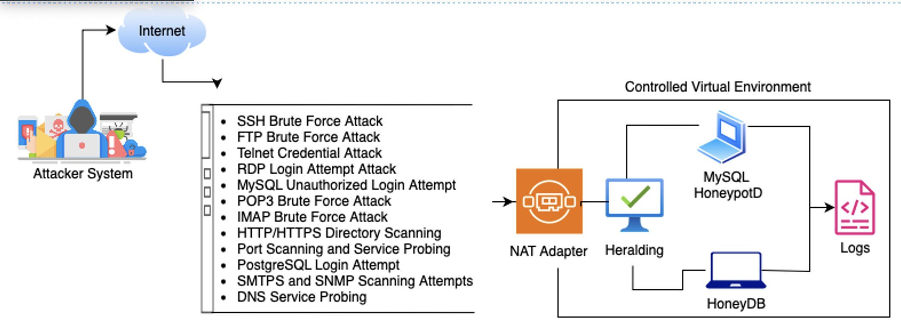
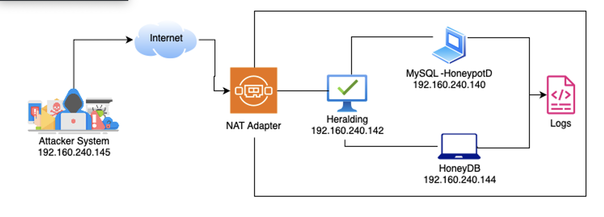

# 🛡️ Comparative Study of Three Open-Source Honeypots: MySQL-HoneypotD, HoneyDB, and Heralding

## 📌 Overview

This project investigates the effectiveness of three open-source honeypots in detecting, logging, and analyzing cyber-attacks. Each honeypot was deployed in a virtual environment and subjected to various simulated attacks. The logs were collected, parsed, and analyzed using the ELK Stack (Elasticsearch, Logstash, Kibana). The study evaluates protocol coverage, detection rate, logging quality, and ease of deployment.


## 🧠 System Architecture




## 🌐 Network Topology




## 🛠️ Tools and Technologies

| Category             | Tools / Tech Used                            |
|----------------------|----------------------------------------------|
| Virtualization       | VMware Workstation Pro                       |
| OS & Distros         | Ubuntu 22.04, Debian 11, Kali Linux          |
| Honeypots            | MySQL-HoneypotD, HoneyDB, Heralding          |
| Attack Tools         | Hydra, Medusa, Nmap, Gobuster, Swaks, etc.   |
| Container Services   | Docker, Docker Compose                       |
| Log Analysis         | ELK Stack (Elasticsearch, Logstash, Kibana)  |


## ⚙️ Honeypot Installation & Configuration

### 🔧 MySQL-HoneypotD

```bash
# Clone source
git clone https://github.com/sjinks/mysql-honeypotd
cd mysql-honeypotd

# Install dependencies
sudo apt install build-essential libmysqlclient-dev

# Build
make

# Configure honeypot to use non-standard port
nano alpine/mysql-honeypotd.confd
# Set: port=3307, bind_address=0.0.0.0

# Redirect port 3306 to 3307
sudo iptables -t nat -A PREROUTING -p tcp --dport 3306 -j REDIRECT --to-port 3307

# Start honeypot
./mysql-honeypotd -b 0.0.0.0 -p 3307
```


### 🔧 HoneyDB Honeypot

```bash
# Download and run setup
curl -1sLf 'https://dl.cloudsmith.io/public/honeydb/honeydb-agent/setup.deb.sh' | sudo -E bash
sudo apt install honeydb-agent

# Configure services
sudo nano /etc/honeydb/services.conf
# Emulate services like SSH (22), FTP (21), HTTP (80), DNS (53), etc.

# Get API credentials from https://riskdiscovery.com/honeydb/

# Configure agent
sudo nano /etc/honeydb/agent.conf
# Set api_id, api_key, node_name, and log_dir

# Start agent
sudo systemctl enable honeydb-agent
sudo systemctl start honeydb-agent
```


### 🔧 Heralding Honeypot

```bash
# Clone repo
git clone https://github.com/johnnykv/heralding.git
cd heralding

# Create virtual environment
python3 -m venv venv
source venv/bin/activate
pip install -r requirements.txt

# Configure honeypot
nano heralding.yml
# Set:
# bind_host: 0.0.0.0
# Ports: FTP (2121), SSH (2222), RDP (3389), HTTP (8080), SMTP (2525), etc.
# Logging: log_session.json, log_auth.csv, session_csv_log_file

# Run
python heralding -c heralding.yml
```


## 🧪 Attack Tools Installation (on Kali VM)

```bash
# Update system
sudo apt update && sudo apt upgrade -y

# Install tools
sudo apt install -y hydra medusa gobuster nmap swaks onesixtyone mariadb-client docker.io docker-compose

# Confirm versions
hydra -h
nmap --version
```


## 🐳 Deploy Vulnerable MySQL (Docker for Decoy)

```bash
# Start docker
sudo systemctl start docker
sudo docker run --name vulnerable-mysql -e MYSQL_ROOT_PASSWORD=root -d -p 3306:3306 mysql:5.7
```


## 📦 ELK Stack Installation (All on Ubuntu VM)

```bash
# Elasticsearch
wget -qO - https://artifacts.elastic.co/GPG-KEY-elasticsearch | sudo apt-key add -
sudo apt install apt-transport-https
echo "deb https://artifacts.elastic.co/packages/7.x/apt stable main" | sudo tee -a /etc/apt/sources.list.d/elastic-7.x.list
sudo apt update && sudo apt install elasticsearch
sudo systemctl enable elasticsearch
sudo systemctl start elasticsearch

# Kibana
sudo apt install kibana
sudo systemctl enable kibana
sudo systemctl start kibana

# Logstash
sudo apt install logstash
```

### Sample Logstash Config

```bash
# Save as: /etc/logstash/conf.d/honeypots.conf
input {
  file {
    path => "/var/log/honeydb/*.log"
    start_position => "beginning"
    type => "honeydb"
  }
  file {
    path => "/var/log/heralding/log_session.json"
    codec => json
    type => "heralding"
  }
}
filter {
  mutate { add_field => { "honeypot" => "%{type}" } }
}
output {
  elasticsearch {
    hosts => ["localhost:9200"]
    index => "honeypots-%{+YYYY.MM.dd}"
  }
}
```

```bash
# Start logstash
sudo systemctl start logstash
```


## 🎯 Attack Simulation Summary

| Service   | Tools      | Attack Type           |
|-----------|------------|------------------------|
| SSH       | Hydra      | Brute force            |
| FTP       | Hydra      | Brute force            |
| MySQL     | Hydra      | Login attempts         |
| HTTP/HTTPS| Gobuster   | Directory enumeration  |
| SMTP      | Swaks      | Open relay test        |
| SNMP      | Onesixtyone| String guessing        |
| POP3/IMAP | Hydra      | Email brute force      |
| DNS       | dig        | Zone transfer test     |
| RDP       | Hydra      | Credential brute force |


## 📊 Evaluation Metrics

| Honeypot         | Services Covered | Format     | Detection Quality | Setup Ease | Log Clarity |
|------------------|------------------|------------|--------------------|-------------|--------------|
| MySQL-HoneypotD  | MySQL            | Plaintext  | Moderate            | High        | Basic        |
| HoneyDB          | SSH, FTP, HTTP   | Structured | High                | Easy        | High         |
| Heralding        | 15+ protocols    | JSON/CSV   | Very High           | Medium      | Very High    |


## 🔍 Results Summary

- **Heralding**: Best for protocol depth, authentication log coverage, and log quality.
- **HoneyDB**: Most versatile and structured low-interaction honeypot.
- **MySQL-HoneypotD**: Lightweight but focused; ideal for targeted MySQL brute-force analysis.


## 👨🏽‍💻 Author

**Ajijola Oluwafemi Blessing**  
Cybersecurity Analyst | Researcher  
📍 United Kingdom  
📧 oluwafemiblessingajijola@gmail.com  
[](https://www.linkedin.com/in/ajijola-oluwafemi-ba839712a/)  


---

## 📄 License

This project is intended for academic and educational purposes only.
